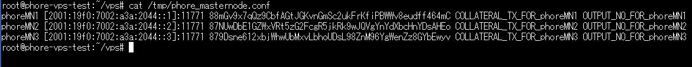

## How to use new features
- Add generate node private key feature
- Add node private key pre-input feature

When using this feature, you don't need to configure axiv_n*.conf on the VPS anymore.

## How to use generate private key feature
1. Enter this command
```bash
git clone https://github.com/AXIVproject/vps.git && cd vps && ./install.sh -p axiv -g
```

2. Whate while the script sets up your node.

3. Let's start your node client. Enter this command
```
activate_masternodes_axiv
```
The node daemons will start and begin loading the axiv blockchain.

4. You need to check the node configuration file created on the VPS. Enter this command:
```
cat /tmp/axiv_masternode.conf
```

It will look similar to this:


Please copy that and paste it to your masternode.conf (fundamentalnode.conf if you are setting up fundamentalnodes) on your local PC in your AXIV data directory.
After this, you need to start from Step 1 of the installation procedure, but since you already generated the private key, you can skip step 2.

## How to use pre-input feature
1. Start From Step 1 of the installation procedure.
2. After completing Step 3, enter this command on VPS:
```bash
git clone https://github.com/AXIVproject/vps.git && cd vps && ./install.sh -p axiv --key **GENERATED PRIVATE KEY**
```
2. Whate while the script sets up your node.

3. Let's start your node client(s). Enter this command:
```
activate_masternodes_axiv
```
The node daemons will start and begin loading the axiv blockchain.

