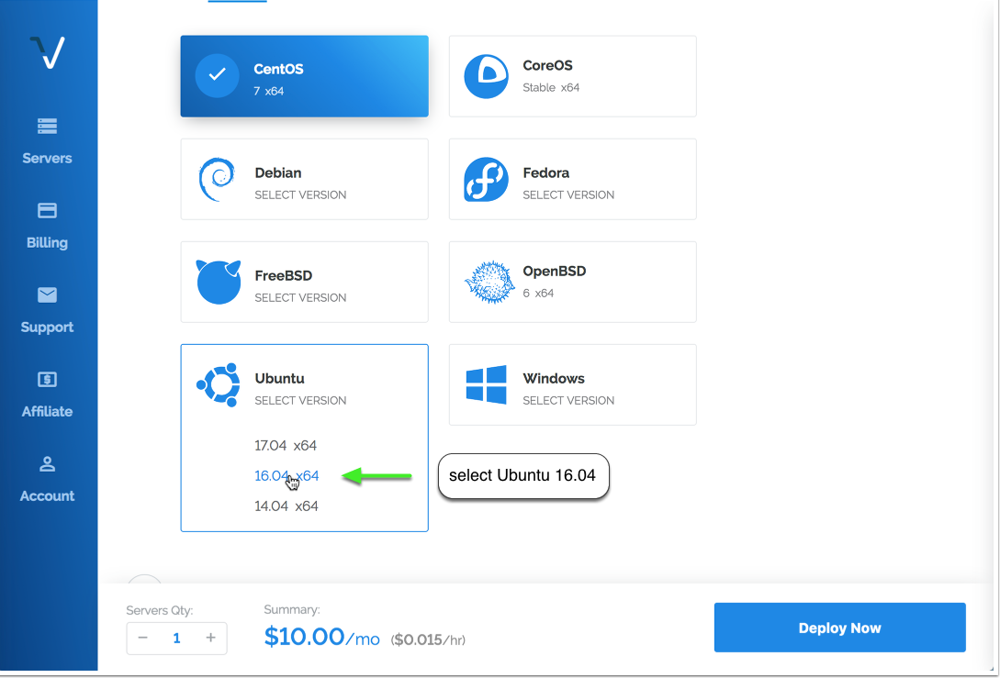
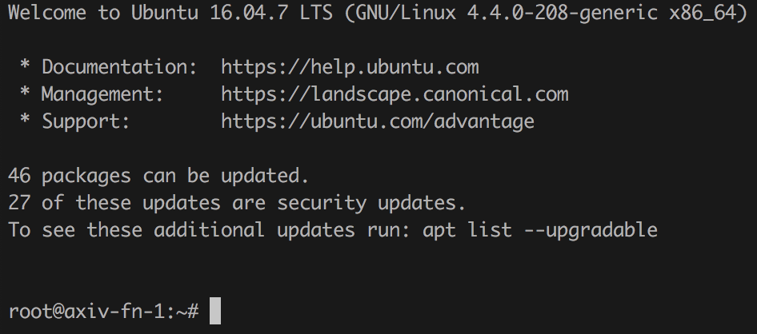

# AXIV Fundamentalnode VPS Installation

This masternode and fundamentalnode installation script vastly simplifies the setup of a AXIV node running on a virtual private server (VPS), and it also adds a number of other powerful features, including:

* IPv6 Support
* Installs 1-100 (or more!) AXIV nodes in parallel on one VPS, with individual axiv.conf and data directories
* It can install nodes for other coins on the same VPS as AXIV
* 100% auto-compilation and 99% of configuration on the masternode side of things
* Automatically compiling from the latest AXIV release tag, or another tag can be specified
* Some security hardening is done, including firewalling and a separate user, increasing security
* Automatic startup for all masternode daemons

Some notes and requirements:

* Script has only been tested on a Vultr VPS, but should work almost anywhere where IPv6 addresses are available
* Currently only Ubuntu 16.04 Linux is supported
* This script needs to run as root or with sudo, the masternodes will and should not!

This project was forked from https://github.com/masternodes/vps. @marsmensch (Florian) is the primary author behind this VPS installation script.
# Install guide on Vultr

## How to get VPS server

For new fundamentalnode owners, **Vultr** is recommended as a VPS hosting provider, but other providers that allow direct root SSH login access and offer Ubuntu 16.04/18.04/20.04 may work.

You can use the following referral link to sign up with Vultr for VPS hosting:

<a href="https://www.vultr.com/?ref=7316561"></a>

## Deploy a new system

First, create a new VPS by clicking that small "+" button.


## Location choice

You can choose any location. You may wish to have it hosted in a city/country near you, or choose a different area to help with the global decentralization of the AXIV fundamentalnode network.


## Linux distribution (Ubuntu 18.04 LTS)

Select Ubuntu 18.04.



## VPS size

The 25 GB SSD / 1024MBB Memory instance is enough for 2-3 masternodes until the blockchain grows very large. You may need more memory and disk space as the AXIV blockchain grows over time, or if you want to run more nodes.


## Activating additional features (IPv6)

Toggle "Enable IPv6" to activate that feature--at Vultr there is no additional cost for this.


Optionally, you can enable DDOS Protection to protect your nodes against a potential denial of service attack--these are not common, but may offer additional protection to keep your nodes running. Vultr charges an additional fee for this.

## Hostnames & number of VPS

Choose how many instances you want and click "Deploy Now".


## Installation of PuTTY as SSH client (Windows)
If you are running your wallet from Windows, install PuTTY while the server is being set up. You can download PuTTY from here: http://www.putty.org/. Skip this step if you are using a Mac--you will use the built in Terminal application instead.

Once PuTTY is installed, return to the Vultr dashboard to get the login details by clicking on the ... to the right of your server, and select Server Details.

## Accessing your VPS via SSH

Copy your password for SSH access from the server details page.


Now open PuTTY to add the server.


Enter the IP address in the Host Name field, and enter the server name you wish to use for this VPS (e.g., axiv-fn-1) to Saved Sessions. Click save.

Click the open button. When the console has opened, click Yes in the PuTTY Security Alert box.


Now enter your server login details provided in your Vultr account.
You cannot Ctrl+V to paste in the console. Either right click the mouse or type shift+insert (sometimes
on keyboard it will just be INS key)

User: root
Password: (paste or type password)

When you paste it will not display, so don't try to paste again.
Just paste once and press Enter.

For Mac users, open Terminal (e.g., Press Command-Space and type Terminal and press Enter). Then type:

```
ssh -l root <IP address>
```
## Install Fundamentalnode

Login to your newly installed node as "root".



To install a single AXIV fundamentalnode, use this command:

```bash
git clone https://github.com/AXIVproject/vps.git && cd vps && ./install.sh -p axiv-fn -n 4 --download https://github.com/AXIVproject/AXIV/releases/download/v1.0.2/axiv-1.0.2-x86_64-linux-gnu.tar.gz
```

If you have your fundamentalnode private key, please use this (you can generate your fundamentalnode private key with Step 2 below).

```bash
git clone https://github.com/AXIVproject/vps.git && cd vps && ./install.sh -p axiv -n 4 --download https://github.com/AXIVproject/AXIV/releases/download/v1.0.2/axiv-1.0.2-x86_64-linux-gnu.tar.gz -k **PRIVATE KEY**
```

Using this alternate command that specifies the private key, you can skip "Configure node configuration files" below, because the command above has already added the node private key to the node configuration file.

The commands above also use an option (-n 4) to have the fundamentalnode use the single IPv4 address assigned to the VPS--this makes it easier for some peers to connect to it. If you want to install multipple fundamentalnodes on the same VPS, see below for how to modify the commands above to handle that.

Note: As new versions of AXIV are released, the link after the --download argument will need to be updated to point to the latest official release. Please check the offical AXIV github to verify that you are downloading the latest offical release at https://github.com/AXIVproject/AXIV/.

This prepares the system and installs the AXIV fundamentalnode daemon. This includes downloading the latest AXIV release, creating a swap file, configuring the firewall. This process should take less than a minute when using the ``--download`` option. If you omit the ``--download`` option, the script will compile the binaries using the AXIV github source code, which typically takes about 10-15 minutes.


For the next step, go back to your local desktop and open axiv-qt.

### More complex situations (ignore if you are installing a single fundamentalnode on a new VPS)

If you wish to install more than one fundamentalnode on the same VPS, you can add a -c parameter to tell the script how many to configure. The -n opption should be omitted in this case since IPv6 addresses are required to run multiple nodes on the same VPS.

For example, this would install three AXIV fundamentalnodes (all entered on one line):

```bash
git clone https://github.com/AXIVproject/vps.git && cd vps && ./install.sh -p axiv-fn --download https://github.com/AXIVproject/AXIV/releases/download/v1.0.2/axiv-1.0.2-x86_64-linux-gnu.tar.gz -c 3 
```

If you are installing a different number of fundamentalnodes, modify the number after -c accordingly.

If you already have your fundamentalnode private keys, you can add them as shown below (all entered on one line):

```bash
git clone https://github.com/AXIVproject/vps.git && cd vps && ./install.sh -p axiv-fn --download https://github.com/AXIVproject/AXIV/releases/download/v1.0.2/axiv-1.0.2-x86_64-linux-gnu.tar.gz -c 3 --key **PRIVATE KEY 01** --key2 **PRIVATE KEY 02** --key3 **PRIVATE KEY 03**
```

Using this command, you can skip the step for "Configure fundamentalnode configuration files", because the command above has already added the fundamentalnode private keys to the fundamentalnode configuration files.

If you are upgrading your node(s) to a new release, you should first remove the old version of the VPS script so that the new one you download is tagged with the latest version, and then add a -u parameter to tell the script to upgrade existing nodes:

```bash
rm -rf /root/vps
```
```bash
git clone https://github.com/AXIVproject/vps.git && cd vps && ./install.sh -p axiv-fn --download https://github.com/AXIVproject/AXIV/releases/download/v1.0.2/axiv-1.0.2-x86_64-linux-gnu.tar.gz -p axiv-fn -u
```

The project is configured to use the latest official release of the AXIV node code, and we will update this project each time a new release is issued, but without downloading the latest version of this project and using the -u parameter, the script will not update an existing AXIV node that is already installed.

## Configure AXIV Wallet
### Step1 - Create Collateral Transaction
Once the wallet is open on your local computer, select the 'Receive' tab and generate a new receive address for the amount of 10,000 AXIV. You may label it however you want to identify your node rewards (e.g., AXIV-FN-1). This label will show up in your transactions each time you receive a fundamentalnode block reward.


Click the Request payment button, and copy the address.


Now go to the ‘Send' tab, paste the copied address, enter *exactly* 10,000 AXIV in the Amount field, check the Fundamentalnode Payment checkbox, click Send, enter your wallet passphrase if it is requested, and then click Yes when the dialog asks if you are sure. For a fundamentalnode, the AXIV will be burned and will leave behind a 0.1234 AXIV amount that will be locked and is needed to keep receiving AXIV fundamentalnode rewards. If you are setting up more than one node at a time, repeat this process for each one.

*You must wait for at least one confirmation (approx. 1 minute) on the blockchain before moving on to the next step!*


### Step 2 - Local PC Node Setup

After waiting for at least one confirmation on the collateral transaction we just created, select Tools->Debug Console from the menu to open the debug console.

Type the following commands in the debug console:
```
fundamentalnode genkey
fundamentalnode outputs
```

Copy and record this information in a notepad or other text editor file. The output from the ``fundamentalnode genkey`` command will need to be added to both the local PC's fundamentalnode.conf file and the VPS node's configuration file. The output from the ``fundamentalnode outputs`` command will need to be added to the local PC's fundamentalnode.conf file.

## End of installations

When the script finishes, it will look similar to this:


You only have a few steps remaining to complete your fundamentalnode configuration.

## Configure fundamentalnode Configuration Files

Since this installation method supports multiple fundamentalnodes, the AXIV configuration files have a node number added to them (e.g., axiv_n1.conf, axiv_n2.conf), stored in the /etc/masternodes directory. If you have a single fundamentalnode on the VPS, you will only need to edit /etc/masternodes/axiv_n1.conf.

To open axiv_n1.conf for editing, enter these commands:

```sudo apt-get install nano```

```nano /etc/masternodes/axiv_n1.conf```

You will see something similar to this:


Copy the IP from ```masternodeaddr=``` (highlighted in red in the image above) and paste it into the ‘VPS IP’ field of the local wallet Masternode setup. Every field should now be full. Copy your ‘Priv Key’ (we will need this soon) and click ‘OK’.


The next step will be to add your masternode private key.

## Add Masternode Private Key

Back in Putty, you only need to change the masternode private key. (We recommend using IPv6 which is the default, but if you choose IPv4 when you ran the installation script, please edit #NEW_IPv4_ADDRESS_FOR_MASTERNODE_NUMBER to your VPS IP address). 

Replace HERE_GOES_YOUR_MASTERNODE_KEY_FOR_MASTERNODE_axiv_1 with the copy of your ‘Priv Key’ from the local wallet.


Once you have your masternode private key entered, press ‘Ctrl+X’ to exit, press ‘Y’ to save when prompted, and press ‘Enter’ to exit.

Once you exit the configuration screen, you can start your masternode.

## Start your Masternode

A script for starting all masternodes on the VPS has been created at /usr/local/bin/activate_masternodes_axiv.sh. Run this command after your masternode configuration written above. To do this, enter:

```/usr/local/bin/activate_masternodes_axiv```

The masternode daemons will start and begin loading the AXIV Blockchain.

## Check Syncing Status of Masternode

The masternode cannot complete activation until it is fully synced with the AXIV Blockchain network.

To check the status of your masternode, please enter the command below in the VPS terminal. If you have multiple masternodes on the same VPS, you can change n1 to n2 etc. to check the status of each one.

```/usr/local/bin/axiv-cli -conf=/etc/masternodes/axiv_n1.conf getinfo```

The output will look like this:

```{
  "version": 1010000,
  "protocolversion": 7002,
  "walletversion": 61000,
  "balance": 0.00000000,
  "privatesend_balance": 0.00000000,
  "blocks": 176209,
  "timeoffset": 0,
  "connections": 44,
  "proxy": "",
  "difficulty": 42882.54964804553,
  "testnet": false,
  "moneysupply" : 11814171.53907114,
  "zPHRsupply" : {
      "1" : 263.00000000,
      "5" : 135.00000000,
      "10" : 500.00000000,
      "50" : 700.00000000,
      "100" : 1300.00000000,
      "500" : 5000.00000000,
      "1000" : 11000.00000000,
      "5000" : 90000.00000000,
      "total" : 108898.00000000
  },
  "keypoololdest" : 1507302593,
  "keypoolsize" : 1001,
  "paytxfee" : 0.00000000,
  "relayfee" : 0.00010000,
  "staking status" : "Staking Not Active",
  "errors" : ""
}
```

We're looking at the blocks, and need that to be the latest block in the blockchain. You can check your local wallet to see the latest block by hovering over the green check mark.


Once your masternode has synced up to the latest block, go to next step. The syncing process may take 15-30 minutes, or more, as the AXIV Blockchain grows. You can keep checking progress with the command above, by pressing the ‘Up’ arrow and the ‘Enter’ key to repeat it (or by pasting the command in again).

## Start Masternode

When your Masternode is fully synced on the VPS, go back to the ‘Masternode’ tab of the local wallet and click ‘Start Alias’. 


Click ‘Yes’ to start your Masternode.

Once you have done this, you should get a confirmation that the Masternode has started successfully!


The ‘Status’ should now say ‘Enabled’, and within an hour the timer in the ‘Active’ column should start increasing.

Congratulations, your AXIV Masternode is now set up and running! Depending on how many masternodes there are, it may take 12-24 hours before you see your first masternode reward. This is normal and rewards should come at more regular intervals after the first one.

## Issues and Questions

Please open a GitHub Issue  here: https://github.com/AXIVproject/vps/issues if there are problems with this installation method. Many AXIV team members actively support people installing masternodes and can provide assistance in the AXIV Discord channel. Here is a Discord invitation:

https://discord.gg/sbgdcdv

If you would like to make a donation to AXIV's ongoing development, you can send AXIV to the core team at this address: PDjGJMDzvJnvbxxgR1bgPm77fFLxn3KAg8
